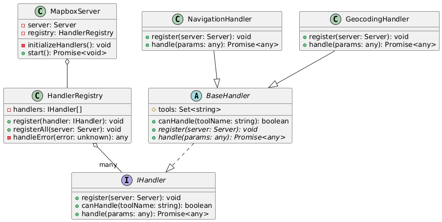
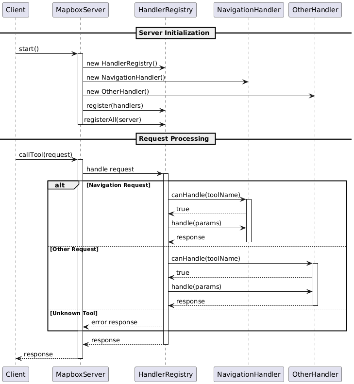

<!--
 * @Author: AidenYangX
 * @Email: xscs709560271@gmail.com
 * @Date: 2024-12-21 23:30:55
 * @Description: Mapbox MCP Server
-->

# Mapbox MCP Server

MCP Server for the Mapbox API.

## Features

### Navigation Tools

1. `mapbox_directions`

   - Get directions between coordinates
   - Inputs:
     - `coordinates` ({latitude: number, longitude: number}[])
     - `profile` (optional): "driving-traffic", "driving", "walking", "cycling"
   - Returns: route details with steps, distance, duration

2. `mapbox_directions_by_places`

   - Get directions between places using their names
   - Inputs:
     - `places` (string[]): Array of place names
     - `profile` (optional): "driving-traffic", "driving", "walking", "cycling"
     - `language` (optional): Two-letter language code (e.g., "zh", "en")
   - Returns:
     - Geocoding results for each place
     - Route details with steps, distance, duration
     - Any errors that occurred during processing

3. `mapbox_matrix`

   - Calculate travel time and distance matrices between coordinates
   - Inputs:
     - `coordinates` ({latitude: number, longitude: number}[])
     - `profile` (optional): "driving", "walking", "cycling"
     - `annotations` (optional): "duration", "distance", "duration,distance"
     - `sources` (optional): Indices of source coordinates
     - `destinations` (optional): Indices of destination coordinates
   - Returns: Matrix of durations and/or distances between points

4. `mapbox_matrix_by_places`
   - Calculate travel time and distance matrices between places using their names
   - Inputs:
     - `places` (string[]): Array of place names (2-25 places)
     - `profile` (optional): "driving", "walking", "cycling"
     - `annotations` (optional): "duration", "distance", "duration,distance"
     - `language` (optional): Two-letter language code
     - `sources` (optional): Indices of source places
     - `destinations` (optional): Indices of destination places
   - Returns:
     - Geocoding results for each place
     - Matrix of durations and/or distances
     - Any errors that occurred during processing

### Search Tools

1. `mapbox_geocoding`
   - Search for places and convert addresses into coordinates
   - Inputs:
     - `searchText` (string): The place or address to search for
     - `limit` (optional): Maximum number of results (1-10)
     - `types` (optional): Filter by place types (country, region, place, etc.)
     - `language` (optional): Two-letter language code
     - `fuzzyMatch` (optional): Enable/disable fuzzy matching
   - Returns: Detailed location information including coordinates and properties

## Claude Desktop Integration

Add this configuration to your Claude Desktop config file (typically located at `~/Library/Application Support/Claude/claude_desktop_config.json`):

```json
{
  "mcpServers": {
    "mapbox-mcp-server": {
      "command": "node",
      "args": ["/absolute/path/to/mapbox-mcp-server/build/index.js"],
      "env": {
        "MAPBOX_ACCESS_TOKEN": "your-api-key"
      }
    }
  }
}
```

## Setup

### Prerequisites

- Node.js 16 or higher
- TypeScript 4.5 or higher
- A valid Mapbox API key

### API Key

Get a Mapbox API key by following the instructions [here](https://console.mapbox.com/account/access-tokens/).

Set your API key as an environment variable:

```bash
export MAPBOX_ACCESS_TOKEN=your_api_key_here
```

## Rate Limits

- Directions API: 300 requests per minute
- Matrix API:
  - 60 requests per minute for driving/walking/cycling
  - 30 requests per minute for driving-traffic
- Geocoding API: 600 requests per minute

## Deployment

### Structure

In mapbox-mcp-server, we use the following structure to manage the server's handlers:

- `src/server/handlers/base.ts`: Base class for all handlers
- `src/server/registry.ts`: Registry for all handlers
- `src/server/main.ts`: Main entry point for the server

Each feature module follows this structure:

```plaintext
src/
├── types/          # Type definitions
├── schemas/        # Zod schemas for validation
├── tools/
│   ├── definitions/  # Tool definitions
│   └── handlers/     # Tool implementations
└── server/
    └── handlers/     # Handler classes
```

---

**Class Diagram**:


---

**Process Diagram**:


## Error Handling

All tools implement comprehensive error handling:

- Input validation errors
- API request failures
- Rate limit errors
- Service-specific errors (e.g., no routes found, invalid coordinates)

## License

This MCP server is licensed under the MIT License. This means you are free to use, modify, and distribute the software, subject to the terms and conditions of the MIT License. For more details, please see the LICENSE file in the project repository.
